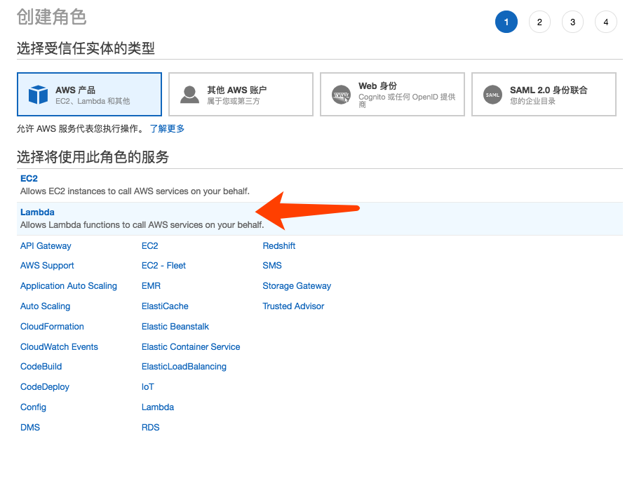
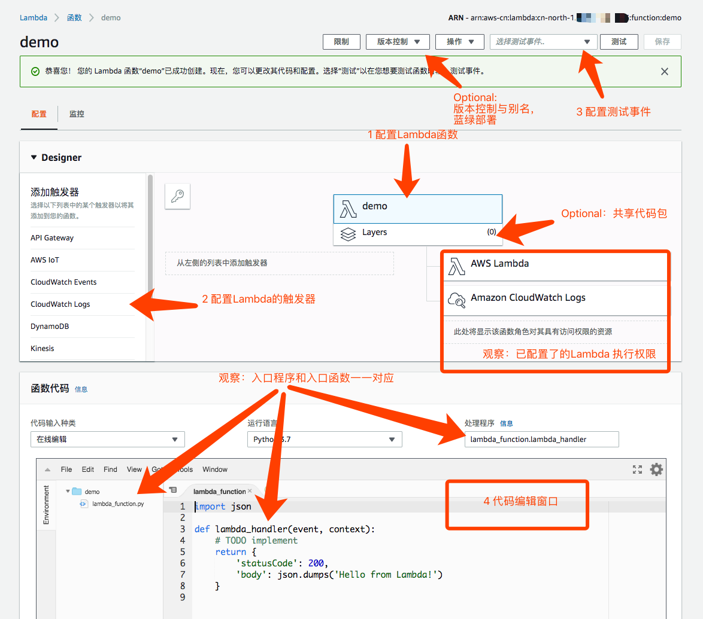
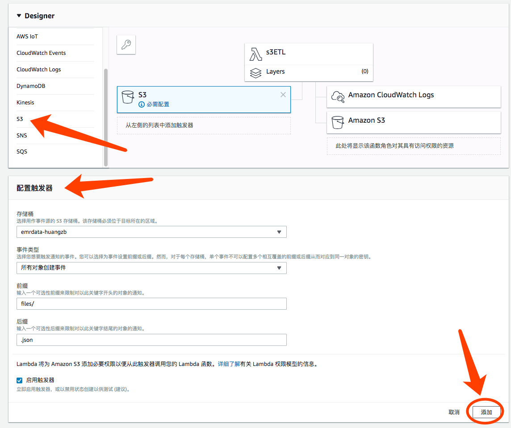

# 动手实验 Lab 2 - Lambda ETL

本实验是在前一实验的基础上，通过文件上传S3自动触发 Lambda，Lambda 从 S3 提取文件，转换，并保存新文件到 S3。

## 前置准备

本实验会利用 Lab 1 的sample data 文件

## 权限准备：生成一个 Lambda 执行的角色

目的：创建一个 IAM Role 为 Lambda 执行角色

具体操作如下：
1. 在控制台 IAM 中新建一个“角色”，指定角色为授权 Lambda 使用

2. 配置该角色权限，该角色拥有 LambdaBaseExcecution 权限（能上传 log 到 CloudWatchLog ），能读写 S3

3. 完成创建，并命名。本例子为 Lambda_access_s3，你可以设置你自己的命名。完成后检查一下角色是类似这样的：

## 观察：新建一个空的 Lambda， 并观察触发事件

目的：通过 S3 新上传文件 users-data.json 触发 Lambda，了解 Lambda 触发机制，以及触发的 Event 构成

1. 创建 Lambda 函数

观察 Lambda 的配置界面

在代码编辑窗口：在 Todo 下面，增加一句代码，用于观察一下 Lambda 启动收到的 Event 是什么

    print(json.dumps(event, indent=4))

Lambda 的设置（保持默认）:  
* 超时时间3秒
* 内存 128MB
* 无 VPC（注：Lambda 如果访问 S3 ，则无需配置 VPC ，如果访问 EMR/RDS 等，则需要配置访问对应的 VPC 。并设置 Lambda 的 ENI 所在的子网和安全组）
* 无调试和错误处理（注：S3 对于 Lambda 调用失败会重试2次，仍失败则在这里设置进入 DLQ-死信队列，供后续处理）
* 非预留账户并发（注：即不限制也不预留并发）

右上角，点保存 Lambda 函数

2. 配置 S3 触发 Lambda

配置 S3 触发 Lambda，并且配置触发的 Bucket、前缀和后缀（本例中定义了 files/ 前缀）

右上角，点保存 Lambda 函数

3. 上传文件到 S3

在 Bucket 里面新建一个 files 目录。上传 users-data.json 文件到对应 Bucket/files/ 去触发 Lambda

4. 观察 Lambda 的 Logs

在 Lambda 监控界面，点击 Invocations -> View logs 从新弹出的 CloudWatch 界面观察 Lambda 的 Log

点上级目录可以看到，按时间拆分的 Logs  

5. Option 步骤:  
新建测试，选择 S3 测试样例事件，修改测试事件的 bucket、arn 和 key，保存

点击“测试”按钮，Lambda 就会被 S3 的 Event 触发，便于后面的调试  

也可以把刚才上传文件到 S3 时触发的事件 copy 到测试事件中，形成更真实的测试样例（注意修改的双引号以符合 json 格式）

## 思考

* 配置 S3 触发 Lambda 的时候，是否可以不设置前缀和后缀 （注：循环触发）
* S3 触发 Lambda 的配置，“所有对象创建事件”包含了什么？

## 初步：处理数据样例 1

目的：上传数据样例文件到 S3，触发 Lambda 处理文件，新文件保存到 S3

1. 把 s3etl-json.py 代码拷贝到 Lambda 中，并保存

    [s3etl-json.py](./s3etl-json.py)

2. 对刚才已经上传 Bucket/files/ 的 users-data.json 文件进行重命名，自由选定一个新名字，此时会触发 Lambda运行  
或者重新上传 users-data.json 到刚才的目录，也可以实现相同的触发。
因为，我们在配置 S3 触发事件的时候，实际上是默认选择了“所有对象创建事件”，包括了上传和重命名

3. 观察执行的 Logs 

4. 到 S3 的 Bucket 下查看新生成的 converted/ 目录里面的文件

## 进阶 1：处理数据样例 2

目的：  
* 上传 pagecounts-20100212-050000.gz (压缩的 csv) 文件到 S3，触发 Lambda 处理文件  
* 对比 Lambda 直接下载 S3 文件进行 ETL 和 S3 Select 的处理差异  
* 调试 Lambda 执行的内存和超时时间

1. 新建一个Lambda

把 s3etl-csv.py 代码拷贝到 Lambda 函数中

    [s3etl-csv.py](./s3etl-csv.py)

2. 配置 S3 触发 Lambda

配置 S3 对应的 Bucket 触发 Lambda，配置 files/ 前缀，这次设置另外一个触发的后缀 .csv  

3. 上传数据样例文件到 S3

因为 pagecounts-20100212-050000.gz 文件比较大，可以采用文件“重命名”来触发

观察 Lambda 的 Log，是否出现执行失败

4. 调整 Lambda 执行内存，调整 Lambda 执行超时时间

本次建议先设置 1.5GB，1分钟超时

5. 重新触发 Lambda（可以用测试样例事件，或修改 S3 上的文件名，或重新上传文件）

观察 Logs，查看执行时间和使用的内存大小

## 进阶 2: 改用 S3 Select 处理数据样例 2

目的：在进阶 1 的基础上改用 S3 Select 处理数据样例 2，对比执行情况

1. 在进阶 1 的 Lambda 函数中，替换掉整个代码为 s3etl-csv-s3select.py

    [s3etl-csv-s3select.py](./s3etl-csv-s3select.py)

2. 再次触发 Lambda
观察 Logs，查看执行时间和使用的内存大小

## 思考

* Lambda 的运行内存应该设置多少，是否越大或越小越好？
* 为什么不用设置 CPU？
* 为什么需要超时时间？
* 尝试调整获取的数据不是 ">50000"，而是 ">500"，或者去掉大于 500 这个条件获取全量数据。
再次对比采用 S3 Select 和 Lambda ETL 的区别。如何采用 S3 Select 和 Lambda ETL 进行结合应用？

## 其他说明：

* Lambda 如果有依赖包，可以打包上传为“层”，要注意打包的目录结构。详见我的另一个文章：
[《使用 AWS Lambda 的“层(Layer)”功能实现依赖包管理》](https://github.com/hawkey999/lambda-layer-demo)
https://github.com/hawkey999/lambda-layer-demo

