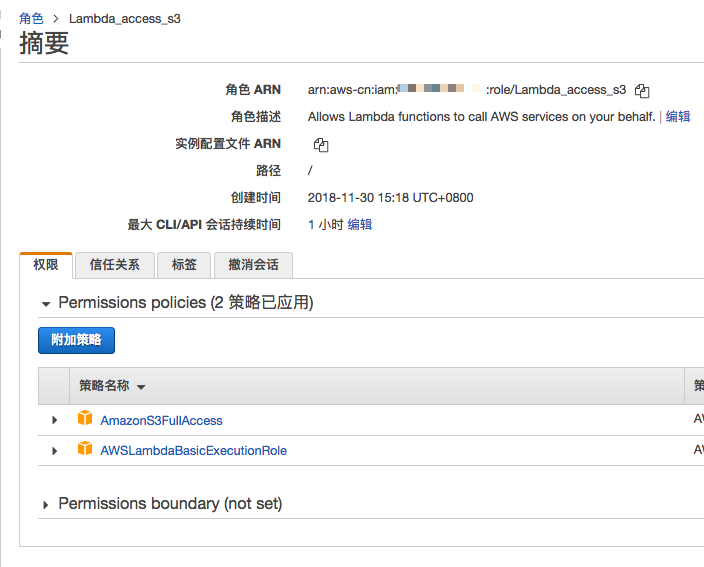
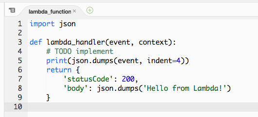
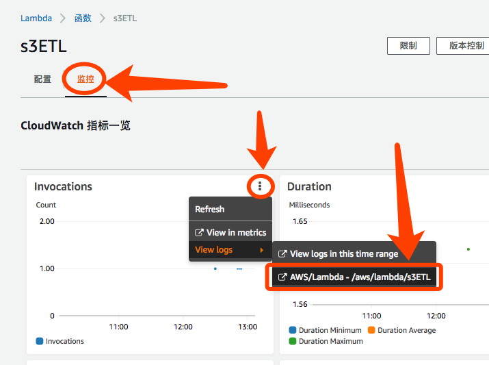

# 动手实验 Lab 2 - Lambda ETL

本实验是在前一实验的基础上，通过文件上传S3自动触发Lambda，Lambda从S3提取文件，转换，并保存新文件到S3。

## 前置准备

本实验会利用 Lab 1 的sample data 文件

## 权限准备：生成一个 Lambda 执行的角色

目的：创建一个 IAM Role 为 Lambda执行角色

具体操作如下：
1. 在控制台 IAM 中新建一个“角色”，指定角色为授权Lambda使用

2. 配置该角色权限，该角色拥有LambdaBaseExcecution权限（能上传log到CloudWatchLog），能读写S3

3. 完成创建，并命名。本例子为 Lambda_access_s3，你可以设置你自己的命名。完成后检查一下角色是类似这样的：

## 观察：新建一个空的 Lambda， 并观察触发事件

目的：通过S3新上传文件users-data.json触发Lambda，了解Lambda触发机制，以及触发的Event构成

1. 创建 Lambda 函数

在Todo下面，增加一句代码，我们来观察一下lambda启动收到的Event是什么

    print(json.dumps(event, indent=4))

Lambda的设置（保持默认）:
* 超时时间3秒
* 内存128MB
* 无VPC（注：Lambda如果访问S3，则无需配置VPC，如果访问EMR，则需要配置访问EMR对应的VPC。并设置Lambda的ENI所在的子网和安全组）
* 无调试和错误处理（注：S3对于Lambda调用失败会重试2次，仍失败则在这里设置进入DLQ-死信队列，供后续处理）
* 非预留账户并发（注：即不限制也不预留并发）

右上角，点保存 Lambda函数

2. 配置 S3 触发 Lambda

配置S3触发Lambda，并且配置触发的Bucket、前缀和后缀（本例中定义了files/前缀）

右上角，点保存 Lambda函数

3. 上传文件到 S3

在Bucket里面新建一个files目录。上传users-data.json文件到对应Bucket/files/ 去触发Lambda

4. 观察 Lambda 的Logs

在 Lambda 监控界面，点击 Invocations -> View logs 从新弹出的CloudWatch界面观察 Lambda的 Log

点上级目录可以看到，按时间拆分的Logs

5. Option 步骤:
新建测试，选择S3测试样例事件，修改测试事件的bucket、arn和key，保存

点击“测试”按钮，Lambda就会被S3的Event触发，便于后面的调试

也可以把刚才上传文件到S3时触发的事件copy到测试事件中，形成更真实的测试样例（注意修改的双引号以符合json格式）

## 思考

* 配置 S3 触发Lambda的时候，是否可以不设置前缀和后缀 （注：循环触发）
* S3 触发Lambda的配置，“所有对象创建事件”包含了什么？

## 初步：处理数据样例1

目的：上传数据样例文件到S3，触发Lambda处理文件，新文件保存到S3

1. 把s3etl-json.py代码拷贝到Lambda中，并保存

    [s3etl-json.py](./s3etl-json.py)

2. 对刚才已经上传Bucket/files/的users-data.json文件进行重命名，自由选定一个新名字，此时会触发Lambda运行
或者重新上传users-data.json到刚才的目录，也可以实现相同的触发。
因为，我们在配置S3触发事件的时候，实际上是默认选择了“所有对象创建事件”，包括了上传和重命名

3. 观察执行的Logs

4. 到S3的Bucket下查看新生成的converted/目录里面的文件

## 进阶1：处理数据样例2

目的：
* 上传pagecounts-20100212-050000.gz(压缩的csv)文件到S3，触发Lambda处理文件
* 对比Lambda直接下载S3文件进行ETL和S3 Select的处理差异
* 调试Lambda执行的内存和超时时间

1. 新建一个Lambda
把s3etl-csv.py代码拷贝到Lambda函数中

    [s3etl-csv.py](./s3etl-csv.py)

2. 配置 S3 触发Lambda
配置S3对应的Bucket触发Lambda，配置files/前缀，这次设置另外一个触发的后缀.csv

3. 上传数据样例文件到S3
因为pagecounts-20100212-050000.gz文件比较大，可以采用文件“重命名”来触发
观察Lambda的Log，是否出现执行失败

4. 调整Lambda执行内存，调整Lambda执行超时时间
本次建议先设置1.5GB，1分钟超时

5. 重新触发Lambda（可以用测试样例事件，或修改S3上的文件名，或重新上传文件）
观察Logs，查看执行时间和使用的内存大小

## 进阶2: 改用S3 Select处理数据样例2

目的：在进阶1的基础上改用S3 Select处理数据样例2，对比执行情况

1. 在进阶1的Lambda函数中，替换掉整个代码为

[s3etl-csv-s3select.py](./s3etl-csv-s3select.py)

2. 再次触发Lambda
观察Logs，查看执行时间和使用的内存大小

## 思考

* Lambda 的运行内存应该设置多少，是否越大或越小越好？
* 为什么不用设置CPU？
* 为什么需要超时时间？
* 尝试调整获取的数据不是“>50000"，而是">500"，或者去掉大于500这个条件，获取全量数据。
再次对比采用S3 Select和Lambda ETL的区别。如何采用S3 Select和Lambda ETL进行结合应用？

