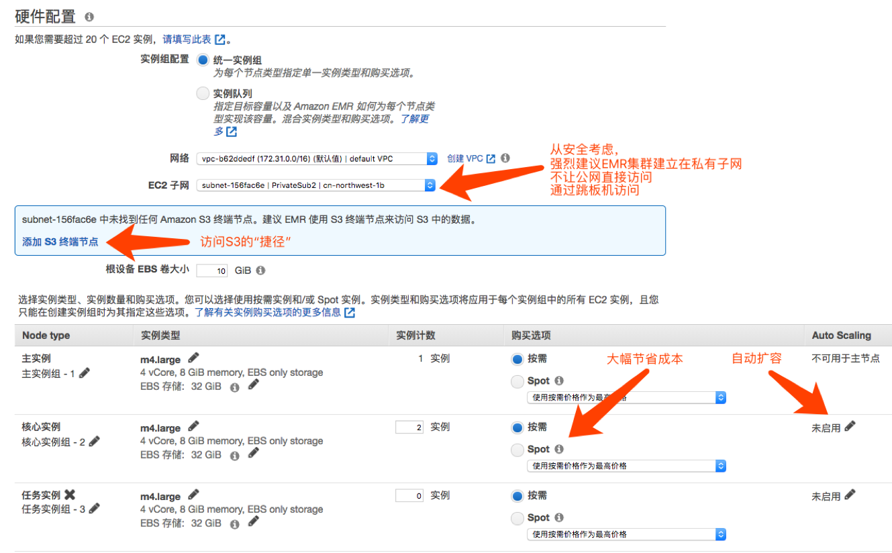

# 动手实验3 EMR - 托管的 Hadoop
目的：操作创建一个 EMR 集群，并且使用 Hive 和 Spark，建外表对 S3 中的数据进行分析

## 把数据放在 S3 数据湖而不是 HDFS
    
* 统一数据源 
* S3 高持久性的数据存储 
* 不用担心 HDFS 节点丢失 
* 不用担心去扩增 HDFS 节点, S3 具有高扩展性 (IOPS, 容量)

  

## 前置知识
确认您已具备以下基本操作知识：
* VPC、子网、安全组的创建
* EC2 的创建，以及使用 Key pair 进行 SSH 登录
* 对 S3 有了解

## 创建 EMR 集群
  
1. 在EMR控制台点创建
  
选择高级选项  
  
选择自动安装的模块  
  
  
2. 配置硬件  
  
强烈建议不要把 EMR 直接暴露在公网，应该配置在私有子网，使用跳板机去访问  
建议配置 S3 终端节点，从 VPC 内部直接访问 S3 ，无需绕道公网  
  
三种节点说明：  
* 主节点 (Master Node): 主节点管理群集，通常运行分布式应用程序的Master组件。例如，YARN  ResourceManager, HDFS NameNode.  
* 核心节点 (Core Node): 核心节点运行HDFS DataNode. 同时还运行任务跟踪守护程序，并对安装的应用程序执行其并行计算任务。例如，运行 YARN NodeManager 守护程序、Hadoop MapReduce 任务和 Spark 执行器。  
* 任务节点 (Task Node): 任务节点是可选的，可以使用任务节点来支持对数据执行并行计算任务，例如 Hadoop MapReduce 任务和 Spark 执行程序。任务节点不运行HDFS 的DataNode守护程序，也不在 HDFS 中存储数据。  
  
3. 一般选项  
   
  
4. 集群安全选项  
   
需要设置一个访问 EC2 的 key
  
5. 完成  
等待集群启动，并观察摘要、监控、硬件、事件、步骤等选项

## 