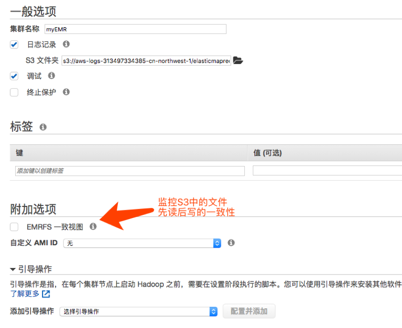
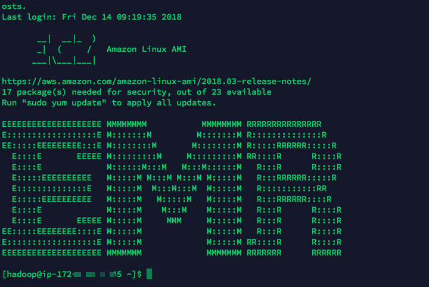

# 动手实验3 EMR - 托管的 Hadoop
目的：操作创建一个 EMR 集群，并且使用 Hive 和 Spark，建外表对 S3 中的数据进行分析  
本实验会用到 Lab 1 的实验样例数据 pagecounts-20100212-050000.gz  

## 把数据放在 S3 数据湖而不是 HDFS
    
* 统一数据源 
* S3 高持久性的数据存储 
* 不用担心 HDFS 节点丢失 
* 不用担心去扩增 HDFS 节点, S3 具有高扩展性 (IOPS, 容量)

  

## 前置知识
确认您已具备以下基本操作知识：
* VPC、子网、安全组的创建
* EC2 的创建，以及使用 Key pair 进行 SSH 登录
* 对 S3 有了解

## 创建 EMR 集群
  
1. 在EMR控制台点创建  
  
  
选择高级选项    
  
  
本实验我们选择了 Hadoop, Hive, Spark  
你可以根据实际情况选择  
  
选择自动安装的模块   
  
  
2. 配置硬件  
  
强烈建议不要把 EMR 直接暴露在公网，应该配置在私有子网，使用跳板机去访问  
建议配置 S3 终端节点，从 VPC 内部直接访问 S3 ，无需绕道公网  
  
三种节点说明：  
* 主节点 (Master Node): 主节点管理群集，通常运行分布式应用程序的Master组件。例如，YARN  ResourceManager, HDFS NameNode.  
* 核心节点 (Core Node): 核心节点运行HDFS DataNode. 同时还运行任务跟踪守护程序，并对安装的应用程序执行其并行计算任务。例如，运行 YARN NodeManager 守护程序、Hadoop MapReduce 任务和 Spark 执行器。  
* 任务节点 (Task Node): 任务节点是可选的，可以使用任务节点来支持对数据执行并行计算任务，例如 Hadoop MapReduce 任务和 Spark 执行程序。任务节点不运行HDFS 的DataNode守护程序，也不在 HDFS 中存储数据。  
  
本次实验可以只选择1个主节点，2个核心节点  

3. 一般选项  
   
  
4. 集群安全选项  
   
需要设置一个访问 EC2 的 key
  
5. 完成创建并修改安全组  
等待集群启动，并观察摘要、监控、硬件、事件、步骤等选项  
  
   

修改 Master 节点的安全组，允许跳板机的 IP 地址访问 22 端口  
   

## Hive 分析样例数据

1. 登录跳板机
将 EMR 访问所需要的 Key pair 上传到跳板机

通过跳板机远程登录 EMR Master 节点  

    ssh -i ~/id_rsa.pem hadoop@<emr-master-dns>
  
   

2. Hive 建外表  
输入命令启动 Hive  

    hive
  
修改以下建表命令的 bucket/prefix 为 pagecounts-20100212-050000.gz 数据文件的位置  

    create external table wikistat
    (projectcode string, pagename string, pageviews int, pagesize int)
    ROW FORMAT DELIMITED FIELDS TERMINATED BY ' '
    Location 's3://bucket/prefix';

    CACHE TABLE wikistat;

如果无法连接建表，检查 S3 的路径是否正确，是否在同一个 Region。  
另外，这几项是采用默认配置，需要时可以检查调整： S3 终端节点是否配置正确，私有子网的 S3 路由是否指向终端节点，EMR 的角色是否允许访问对应的 S3 Bucket

  

尝试执行 SQL 进行数据分析

    select pagename, sum(pageviews) c
    from wikistat group by pagename order by c desc
    limit 10;

尝试其他 SQL  

    select pagename, pageviews from wikistat where pageviews > 50000;

退出 Hive 

    exit;

3. Spark-sql
输入命令减少 INFO 输出  

    sudo sed -i 's/INFO/ERROR/g' /usr/lib/spark/conf/spark-defaults.conf  
    sudo sed -i 's/INFO/ERROR/g' /usr/lib/spark/conf/log4j.properties  

启动 spark-sql  

    spark-sql  

执行与 Hive 实验中相同的 SQL 比较执行效率  
  
    ...

退出 spark-sql

    exit;

4. 可选实验：Spark-shell  

进入 spark-shell ：  

    spark-shell

执行以下命令

    val file = sc.textFile("s3://<BUCKET>/<Prefix>/pagecounts-20100212-050000.gz")
    val reducedList = file.map(l => l.split(" ")).map(l => (l(1), l(2).toInt)).reduceByKey(_+_, 3)
    reducedList.cache
    val sortedList = reducedList.map(x => (x._2, x._1)).sortByKey(false).take(50)

输出的排序结果类似如下：  

    sortedList: Array[(Int, String)] = Array((328476,Special:Search), (217924,Main_Page), (73900,Special:Random), (65047,404_error/), (55814,%E3%83%A1%E3%82%A4%E3%83%B3%E3%83%9A%E3%83%BC%E3%82%B8), (21521,Special:Export/Where_Is_My_Mind), ...

退出

    :quit

5. 可选实验：Hive 分析 CloudTrail 日志
CloudTrail 跟踪 AWS 账户中所有的 API 日志，是非常重要的审计工具，使用 Hive/Spark/Presto 都可以有效地进行日志搜索和分析，以下以 Hive 为例  
  
建表
```
CREATE EXTERNAL TABLE cloudtrail_logs (
eventversion STRING,
userIdentity STRUCT<
            type:STRING,
            principalid:STRING,
            arn:STRING,
            accountid:STRING,
            invokedby:STRING,
            accesskeyid:STRING,
            userName:STRING,
sessioncontext:STRUCT<
attributes:STRUCT<
            mfaauthenticated:STRING,
            creationdate:STRING>,
sessionIssuer:STRUCT<
            type:STRING,
            principalId:STRING,
            arn:STRING,
            accountId:STRING,
            userName:STRING>>>,
eventTime STRING,
eventSource STRING,
eventName STRING,
awsRegion STRING,
sourceIpAddress STRING,
userAgent STRING,
errorCode STRING,
errorMessage STRING,
requestParameters STRING,
responseElements STRING,
additionalEventData STRING,
requestId STRING,
eventId STRING,
resources ARRAY<STRUCT<
            ARN:STRING,
            accountId:STRING,
            type:STRING>>,
eventType STRING,
apiVersion STRING,
readOnly STRING,
recipientAccountId STRING,
serviceEventDetails STRING,
sharedEventID STRING,
vpcEndpointId STRING
)
ROW FORMAT SERDE 'com.amazon.emr.hive.serde.CloudTrailSerde'
STORED AS INPUTFORMAT 'com.amazon.emr.cloudtrail.CloudTrailInputFormat'
OUTPUTFORMAT 'org.apache.hadoop.hive.ql.io.HiveIgnoreKeyTextOutputFormat'
LOCATION 's3://<logs location>';
```  
尝试各种查询，例如：

    select * from cloudtrail_logs_sub where eventname = 'AssumeRole' limit 3;
    select * from cloudtrail_logs_sub where eventname like '%DBInstances' limit 3;
    select eventName, count(*) c from cloudtrail_logs group by eventName order by c desc limit 5;

Cloutrail日志分析请参考文档：  
https://docs.aws.amazon.com/zh_cn/athena/latest/ug/cloudtrail-logs.html